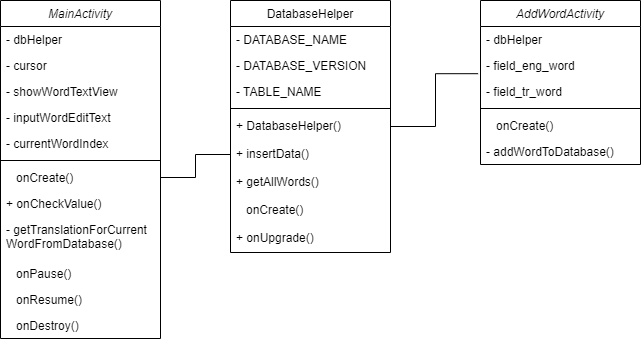

## Несколько уточняющих моментов

- 1.gif и 2.gif показывают работу приложения на эмуляторе и уже установленного приложения на смартфоне.
- В папке `Word` содержится весь проект, разработанный в Android Studio. [Android Studio](https://developer.android.com/studio) доступен для установки по ссылке.
- В папке `apk` находится установщик приложения. Чтобы загрузить приложение, скачайте папку на свой Android-телефон и запустите установщик `app-debug.apk`. После установки приложения его можно будет запустить.

### О приложении

В приложении реализована только малая часть того, что должно было быть, а именно, повторение иностранных слов, загруженных в базу данных, и добавление своих слов, но этого было достаточно, чтобы применить некоторые паттерны проектирования.

Вот несколько паттернов, использованных в работе:

1. **Singleton (Одиночка)**:
   - `DatabaseHelper` используется для работы с базой данных. Он создается только один раз в каждой активности (`MainActivity` и `AddWordActivity`). Это гарантирует наличие только одного экземпляра `DatabaseHelper` в пределах каждой активности.

2. **Фасад (Facade)**:
   - `DatabaseHelper` действует как фасад, предоставляющий удобный интерфейс для работы с базой данных. Он скрывает сложности взаимодействия с базой данных, предоставляя простые методы, такие как `insertData` (добавление), `getAllWords` (получение всех слов) и другие, скрывая подробности реализации.

3. **Шаблонный метод (Template Method)**:
   - Методы `onCreate`, `onPause`, `onResume`, `onDestroy` - это шаблонные методы жизненного цикла активности в Android. Они переопределены, добавляя свою логику к стандартному жизненному циклу активности.

### Диаграмма классов

#### Паттерн, который я бы не использовал

Абстрактная фабрика (Abstract Factory): В данном приложении не потребовалось создание семейства связанных или зависимых объектов без указания их конкретных классов на данном этапе разработки.
